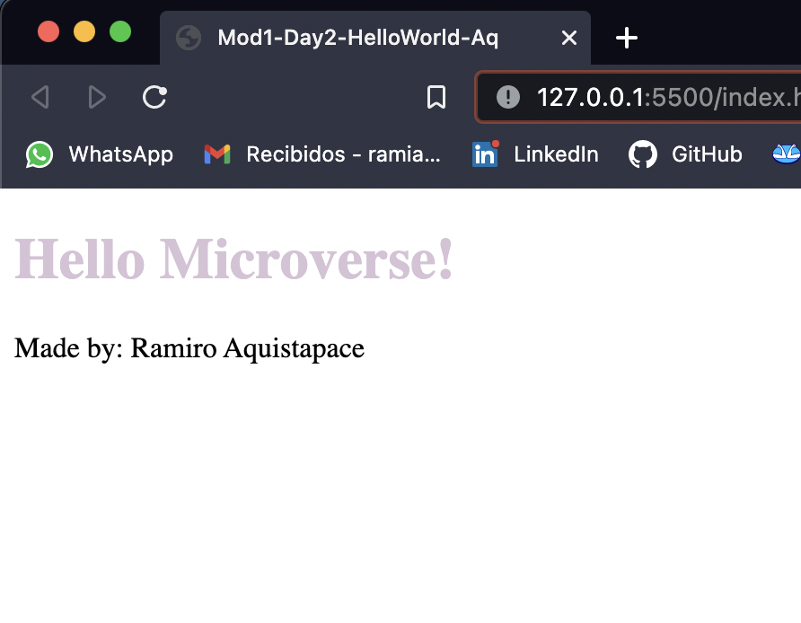

# Module 1 Day 2 Hello World Repo - Ramiro Aquistapace

> In this project, I have set up a simple Hello World Repository to practice mi Git - GitHub - Git Flow skills.

It is very important to acquire this skills in order to land in my dream job!

## Built With

- HTML - CSS
- Git - Github - GitFlow

## Getting Started

To get a local copy up and running follow these simple example steps.

### Prerequisites

Visual Studio Code or Sublime Text

### Setup

Go to the top of the page, press te green button that says "Code", and copy the link. Then you have to go to your console and type " git clone 'repository-url.com' ".

That's all, you are ready to go!

### Install

No extra dependencies needed to use the code!

### Usage

Add Live Server VSCode extension to deploy a local host server in order to start using it!

## Authors

👤 **Author : Ramiro Aquistapace**

- GitHub: [@ramiaquista](https://github.com/ramiaquista)
- Twitter: [@ramiaq1](https://twitter.com/ramiaq1)
- LinkedIn: [RamiroAquistapace](https://www.linkedin.com/in/ramiro-aquistapace-32b61b204/)

## 🤝 Contributing

Contributions, issues, and feature requests are welcome!

## Show your support

Give a ⭐️ if you like this project!
